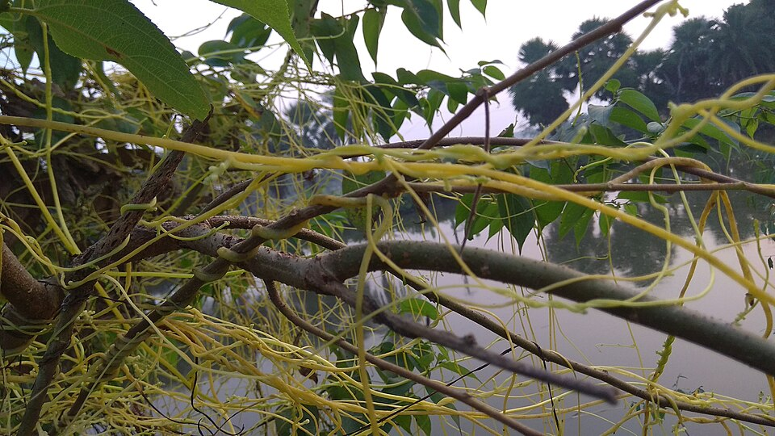

# Reconocer la cúscuta

*Foto: ShahadatHossain, [CC BY-SA 4.0](https://creativecommons.org/licenses/by-sa/4.0), vía Wikimedia Commons.*

La cúscuta (*Cuscuta* spp.) es muy fácil de reconocer una vez que sabes qué buscar: parece una maraña
de **hilos o fideos delgados de color amarillo o anaranjado** enroscados sobre las ramas y hojas del
mezquite. No tiene hojas verdes visibles, así que ese color brillante destaca de inmediato.

A diferencia del paxtle, **la cúscuta SÍ es una planta parásita.** Sus hilos se adhieren al árbol y
penetran en sus tejidos para **extraerle agua y nutrientes** directamente. Es decir, se alimenta del
mezquite a costa de él.

Cuando la cúscuta cubre mucha superficie, el árbol pierde recursos que necesitaba para crecer y
mantenerse sano. Por eso es importante documentarla: saber dónde aparece y con qué intensidad ayuda al
consorcio a entender cómo afecta a los mezquites de la zona.

Al observar un árbol, busca esos **hilos amarillos o anaranjados enredados**. Si los ves, estás frente
a cúscuta (parásita), no frente al paxtle (las motas grises, que no es parásita). Distinguir las dos es
clave para una buena observación.

## Saber más

- [Cúscuta en Naturalista / iNaturalist México](https://mexico.inaturalist.org/taxa/Cuscuta_americana)
- [La cúscuta — "Desde el Herbario" (CICY, PDF)](https://www.cicy.mx/Documentos/CICY/Desde_Herbario/2010/2010-07-15-Tapia-Cuscuta-en-la-Peninsula-de-Yucatan.pdf)
